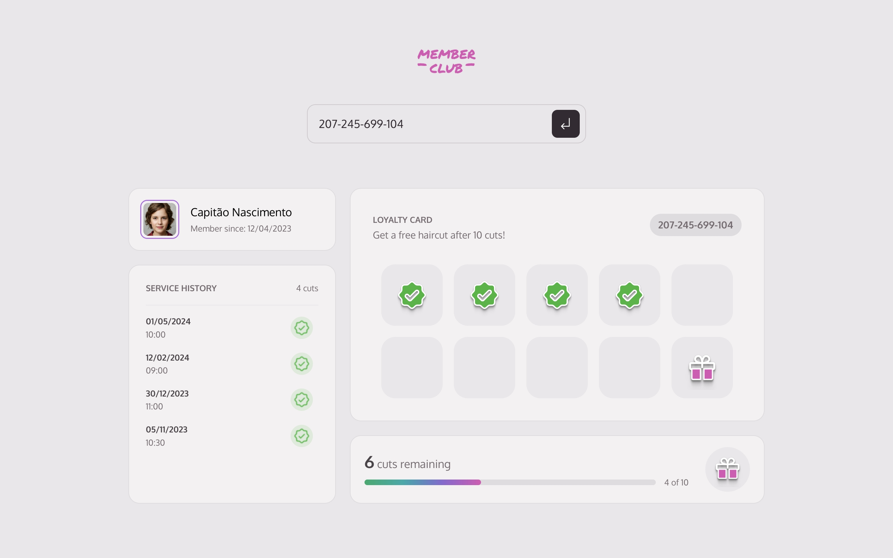
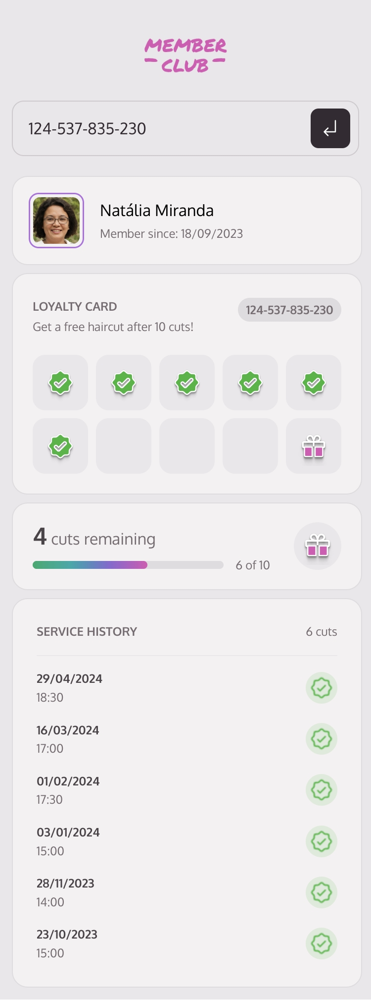

# Member Club - Internal Tool

  
  

**Member Club** is an internal tool developed to search and display detailed client information based on their loyalty cards. This project focuses on modern web development practices using **vanilla JavaScript** and **CSS** to create a responsive and dynamic interface.

## Objective

The main goal of this project is to reinforce and practice the following web development skills:

- Managing **global state** in a vanilla JavaScript application.
- Manipulating the **DOM** to dynamically render client information.
- Following **modular CSS** practices for organizing styles.
- Creating a **dynamic progress bar** to display loyalty card progress.
- Validating and handling **forms** to search for clients and render data.

## Features

- **Client Search**: Users can search for clients by their ID. The app will fetch the client's data and display it dynamically on the screen.
- **Progress Tracking**: A progress bar shows how many haircuts the client has left before earning a free haircut.
- **Loyalty Card Display**: The loyalty card section visually represents the client’s cuts history.
- **Appointment History**: A detailed history of the client’s previous appointments is shown, along with the date and time of each appointment.

## Project Structure

- **HTML**: The base structure for the user interface.
- **CSS**: Modular CSS files for specific sections like header, profile, card, and progress bar.
- **JavaScript**: Separate modules for managing global state, handling forms, and rendering dynamic content.

## Best Practices Used

- **Separation of Concerns**: CSS, JavaScript, and HTML are modularized for better maintainability.
- **Global State Management**: The `userState.js` file manages the client data globally, allowing easy access across the application.
- **Form Validation**: The ID input is validated before any client search is performed.
- **Progress Bar Animation**: A smooth transition for the progress bar using `CSS transitions` for an interactive visual effect.

## How It Works

1. The user searches for a client by entering their ID in the input form.
2. If the client is found, the data is fetched from the API and stored in the global state.
3. The client’s profile, loyalty card, and appointment history are dynamically rendered on the page.
4. A progress bar shows how many cuts the client has left before earning a reward.
5. The loyalty card visually displays stamps for completed cuts, and a gift icon for the final cut.

## Technologies Used

- **HTML5**
- **CSS3**
- **JavaScript (ES6 modules)**

## How to Run

1. Clone the repository.
2. Install dependencies if necessary (for API or local server).
3. Open `index.html` in your browser to run the application locally.
